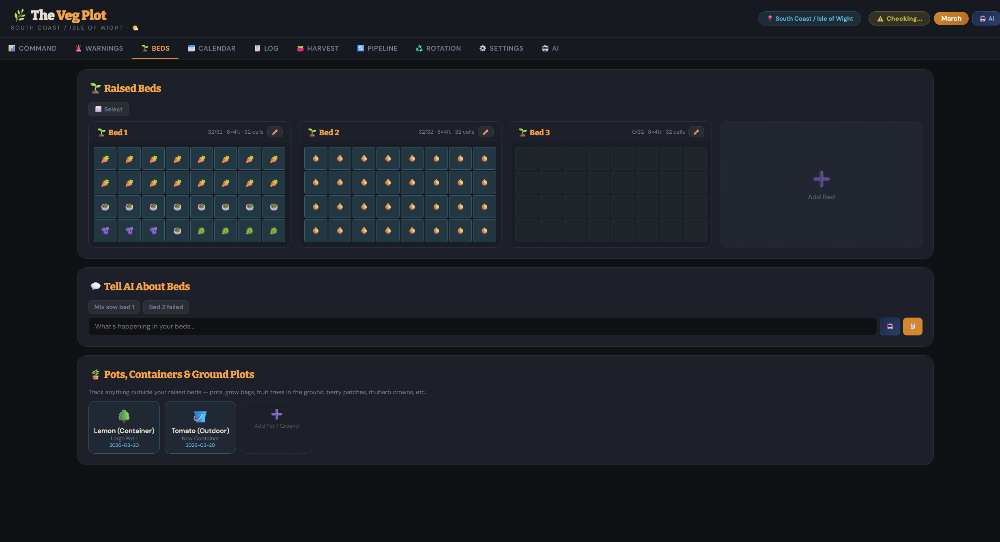

# 🌿 The Veg Plot — Survival Edition

A comprehensive UK vegetable garden planner built as a single HTML file. No server, no install, no dependencies — just open it in a browser and start planning your food production like your survival depends on it.

**[🚀 Try it live on GitHub Pages →](https://majestic10110.github.io/survival_veg_planner/)**

---

## Features

### 📊 Command Centre Dashboard
- **Food Security Score** (0–100) combining year-round coverage, bed utilisation, overdue harvests, and crop variety
- **12-Month Food Timeline** showing projected harvests per month — red months mean nothing coming
- Critical alerts, succession sowing tips, and nearest harvest countdowns

### 🚨 Harvest Warnings & Gap Analysis
- **4-tier harvest alerts**: Overdue (pulsing red), Imminent (≤3 days), Soon (≤14 days), Upcoming
- **Harvest gap analysis** identifying months with zero projected food
- **Emergency sowing recommendations** with fast-growing crops (radish 25d, rocket 21d, turnips 50d)
- Toast notifications for approaching and overdue harvests

### 📍 Location-Aware Growing (6 UK Climate Zones)
- **South Coast / Isle of Wight** — mildest, longest season (~250 frost-free days)
- **Southern England** — standard UK calendar
- **Midlands** — slightly later, earlier frosts
- **Northern England / Wales** — cool, shorter season
- **Scottish Lowlands** — short season, root veg focus
- **Scottish Highlands** — very harsh (~100 frost-free days)

All sowing dates, harvest windows, and days-to-maturity automatically adjust when you change zone. Your location is saved until you change it.

### 🏡 Greenhouse & Polytunnel Support
- Toggle **Greenhouse** and **Polytunnel** environments in Settings
- Calendar shows **separate tabs** with extended sowing/harvest windows for each environment
- Create **greenhouse beds** and **polytunnel beds** with their own growing times
- Crops in protected beds automatically get faster maturity and extended seasons

### 🌱 Dynamic Bed Management
- **Add beds** of any size (2×2 to 16×8) with 10 presets including greenhouse and polytunnel beds
- **Edit beds** — rename, resize, change environment
- **Delete beds** with confirmation
- Visual grid with click-to-plant, drag-select, and harvest-due glow effects
- Beds show environment badges (🏡 Greenhouse, 🫧 Polytunnel, 🌱 Outdoor)

### 🪴 Full Pot & Container Tracking
- **Add pots** from 8 preset types (grow bag, hanging basket, window box, etc.) or custom
- **Edit pots** — rename, change icon, assign plants
- **Delete pots** at will
- Pots are fully integrated into harvest projections, food timeline, gap analysis, pipeline, and warnings

### 🔄 Food Production Pipeline
- Visualise what's at each stage: Sowing → Growing → Ready → Storable
- Per-crop progress bars showing percentage grown
- Weekly sowing actions for continuous production

### 📅 Planting Calendar
- Full UK planting calendar with zone-adjusted dates
- Environment tabs to switch between Outdoor / Greenhouse / Polytunnel views
- Cold-hardy crops marked with ❄️, fast growers with ⚡

### 🤖 AI Advisor (LM Studio)
- Connect to a local LLM via LM Studio for personalised gardening advice
- Supports **reasoning models** (Qwen, DeepSeek-R1) — handles empty content + reasoning_content
- Context-aware: sends your location, beds, plantings, food security score, and active warnings
- Quick-ask buttons for monthly jobs, succession, pests, companions

### ♻️ Crop Rotation & Companions
- 4-year rotation planner across all beds
- Companion planting guide
- Succession sowing schedule with zone-adjusted dates

### 💾 Data Management
- All data saved in localStorage — persists between sessions
- **Export** your entire garden as JSON backup
- **Import** from backup file
- Reset option for fresh start

---

## Getting Started

1. **Download** `index.html` (or clone this repo)
2. **Open** it in any modern browser (Chrome, Firefox, Edge, Safari)
3. Go to **Settings** → set your **location** and enable **greenhouse/polytunnel** if you have them
4. Start adding beds, pots, and logging your plantings

That's it. No build step, no npm, no server. It's one HTML file.

---

## AI Advisor Setup (Optional)

The AI features require [LM Studio](https://lmstudio.ai/) running locally:

1. Download and install LM Studio
2. Load a model (recommended: Qwen 2.5 7B or similar)
3. Start the local server (default: `http://127.0.0.1:1234/v1/chat/completions`)
4. In the app, go to the AI tab and click "Test" to verify connection

**Tip:** If using a reasoning model (Qwen3, DeepSeek-R1), set max_tokens to 8192+ in LM Studio to avoid the model running out of tokens during its thinking phase.

---

## Tech Stack

- **Zero dependencies** — pure HTML, CSS, and vanilla JavaScript
- **Single file** — everything in one `index.html`
- **~1400 lines** of code
- Google Fonts (Bitter + DM Sans) loaded from CDN
- localStorage for persistence

---

## Contributing

Found a bug or want to add a feature? PRs welcome! Some ideas:

- [ ] More vegetable varieties
- [ ] Weather API integration
- [ ] Photo diary for each bed/pot
- [ ] Print-friendly calendar view
- [ ] Multi-year harvest history tracking
- [ ] Frost date alerts based on weather data

---

## License

MIT License — use it, share it, grow food with it. 🌱
